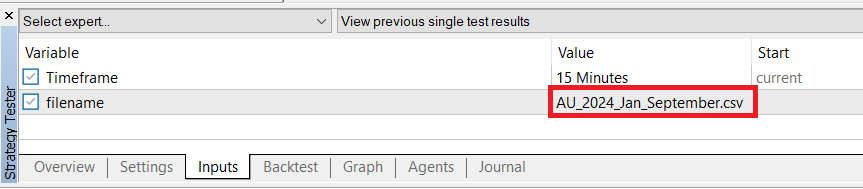
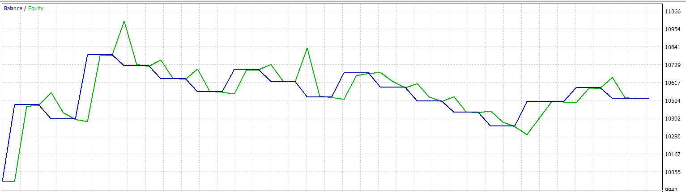
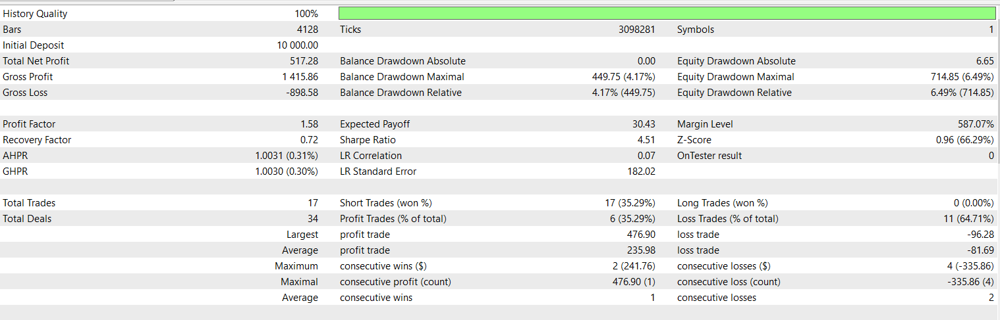
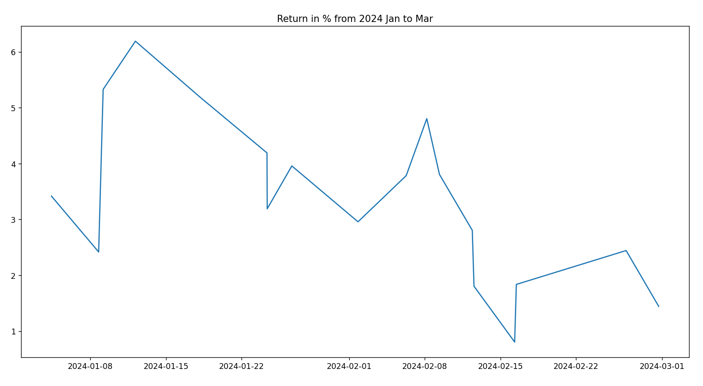
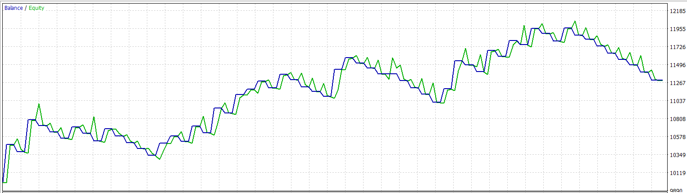

# Algorithmic Trading
## Overview
This project develops an algorithmic trading strategy based on market structure and fractal theory. It aims to identify swing highs and lows across multiple timeframes, including 15-minute, 1-hour, 4-hour, and daily charts. By analyzing these swings, the algorithm calculates potential entry points, stop losses, and take profits for each trade and executes them one at a time.

## Ideation
Market movements often follow cyclical waves of uptrends and downtrends, creating distinct swing highs and lows. Inspired by Bill Williams' fractal theory, this project identifies these swings and uses them to guide trade entries. Here’s how it works:

1. Fractal Identification: Using a 5-bar interval on either side, the algorithm identifies swing highs and lows across multiple timeframes.
2. Retracement Analysis: When the price approaches a swing high or low, the algorithm calculates potential entry points based on price retracement.
3. Position Execution: The algorithm generates a position list with key details, including:
- Entry time
- Entry price
- Stop loss
- Take profit
4. Trade Execution: Only one trade is open at any time. The generated position list is sent to the MetaTrader 5 (MT5) platform.
5. Performance Evaluation: The strategy’s performance is examined by running it through MT5’s Strategy Tester to assess results and optimize further.
## Requirements
To run the code, you’ll need the following Python libraries:

- pandas for data handling
- plotly for data visualization
- numpy for numerical operations
- matplotlib for plotting
- datetime for date and time manipulations

## Usage
1. Set up your trading environment with the MetaTrader 5 (MT5) platform.
2. Run the script to generate a position list based on the fractal identification and retracement analysis, make sure to change the database address and appropriate result address.
3. Send the position list (csv file in folder result) to MT5 for execution in the folder `User\AppData\Roaming\MetaQuotes\Terminal\Common\Files`.
4. Evaluate performance using the MT5 Strategy Tester. Change the name of the csv file from the input and custom period in the MT5 strategy tester.

## Backtest result
From 2024 1st Jan to 1st Mar:

Result from MT5 show that an increase of 5% is generated using the strategy. Whereas, the result from python is less than 1%.

The different is caused because of spread, fee and real time data from MT5. Therefore, the main analysis is done based on MT5 simulation rather than python calculation.

Result from 
From 2024 1st Jan to 1st September:

Enhancing the strategy by locking in spikes of unrealized profit can help minimize maximum drawdown and boost overall returns. Further analysis of take profit mechanisms will be conducted.

## Milestones
- [x] Create a Python code for visualizing swing high/low of higher timeframes on the current timeframe for analysis purposes.
- [x] Develop an MT5 script for executing trades based on the list of positions generated by the Python code, to be tested in the Strategy Tester.
- [ ] Study the Fractal Wave Algorithm by Bill Dreiss to explore the potential for a parameterless strategy.
- [ ] Design various signal formations based on fractal waves within a trend-following context.
- [ ] Research position scaling methods aimed at maximizing profit for each captured trend, while evaluating the impact on the Sharpe ratio.
- [ ] Explore methods to increase the number of monthly positions to smooth the equity curve, aiming to reduce maximum drawdown duration. This includes evaluating lower timeframe opportunities (5-minute, 1-minute) while accounting for the effects of spread and fees in backtesting.

## Disclaimer
- This project is for educational and experimental purposes. Trading in financial markets involves risk, and it's essential to test and refine strategies on demo accounts before considering any live trading.